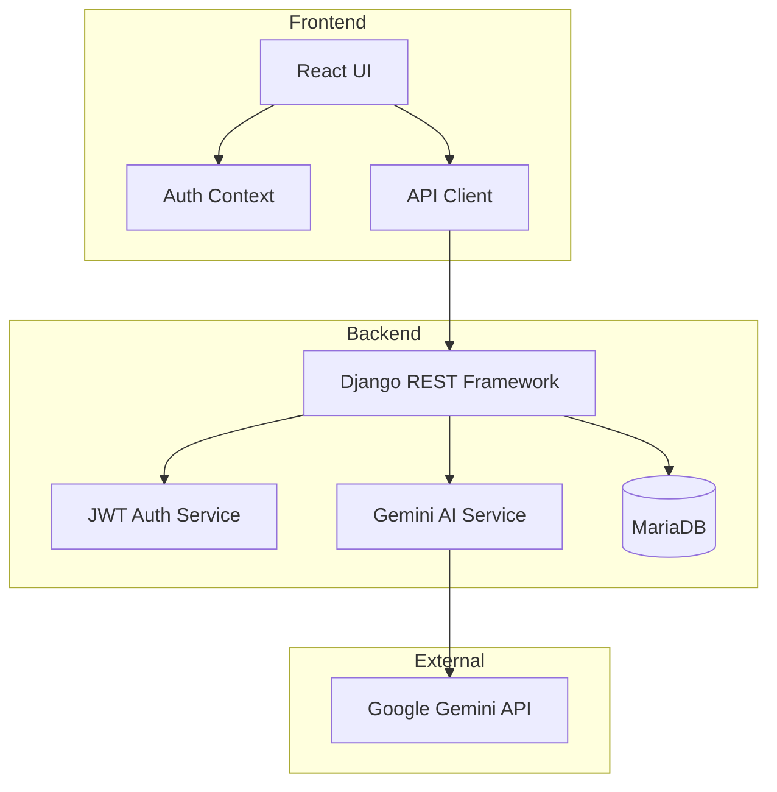
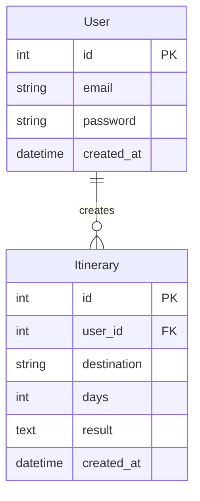

# AI Travel Itinerary Planner

A web application that generates personalized travel itineraries using AI and maintains a history of past requests. The application provides detailed day-by-day plans with activities, timings, and cost estimates.

## Tech Stack

### Frontend 
- React.js with TypeScript
- TailwindCSS for styling
- Axios for API calls
- React Router for navigation
- React Markdown for rich text rendering
- React Icons for UI elements

### Backend
- Django (Python)
- Django REST Framework
- MariaDB database
- Google Gemini 1.5 API for itinerary generation
- JWT Authentication
- CORS support

## Features
- **Smart Itinerary Generation**
  - Input destination and number of days
  - AI-generated daily itineraries with detailed activities
  - Time-based scheduling (AM/PM)
  - Cost estimates for activities
  - Transportation recommendations
  - Local customs and safety tips

- **User Management**
  - User registration and authentication
  - Secure password handling
  - JWT-based session management
  - User-specific itinerary history

- **History & Viewing**
  - Complete history of past requests
  - Detailed view of each itinerary
  - Markdown-formatted descriptions
  - Activity-wise cost breakdown
  - Day-wise organization

- **UI/UX**
  - Responsive design for all devices
  - Dark mode interface
  - Loading states and animations
  - Error handling and notifications
  - Clean and intuitive navigation

## Architecture



## Database Schema



## Setup Instructions

### Prerequisites
- Python 3.8+
- Node.js 14+
- npm or yarn
- Google AI Studio API key
- MariaDB server

### Backend Setup
1. Create a virtual environment:
```bash
python -m venv venv
source venv/bin/activate  # On Windows: venv\Scripts\activate
```

2. Install dependencies:
```bash
cd backend
pip install -r requirements.txt
```

3. Set up environment variables:
Create a `.env` file in the backend directory with:
```
GOOGLE_API_KEY=your_api_key_here
DB_NAME=your_db_name
DB_USER=your_db_user
DB_PASSWORD=your_db_password
DB_HOST=localhost
DB_PORT=3306
SECRET_KEY=your_django_secret_key
```

4. Run migrations:
```bash
python manage.py migrate
```

5. Start the server:
```bash
python manage.py runserver
```

### Frontend Setup
1. Install dependencies:
```bash
cd frontend
npm install
```

2. Start the development server:
```bash
npm start
```

## API Documentation

### Authentication Endpoints
- POST `/api/auth/register/`
  - Request body: `{ "email": string, "password": string }`
  - Returns JWT token

- POST `/api/auth/login/`
  - Request body: `{ "email": string, "password": string }`
  - Returns JWT token

### Itinerary Endpoints
- POST `/api/itinerary/`
  - Request body: `{ "destination": string, "days": number, "user_email": string }`
  - Returns generated itinerary

- GET `/api/history/`
  - Headers: `Authorization: Bearer <token>`
  - Returns list of past itinerary requests

## LLM Integration
This project uses Google's Gemini 1.5 API for generating travel itineraries. The API is accessed through Google AI Studio's free tier.

[Google AI Studio Documentation](https://ai.google.dev/docs/gemini_api_overview)

## Project Structure
```
ai-travel-itinerary-planner/
├── backend/
│   ├── travel_app/
│   │   ├── models.py
│   │   ├── views.py
│   │   ├── serializers.py
│   │   └── urls.py
│   ├── travel_planner/
│   │   ├── settings.py
│   │   └── urls.py
│   ├── manage.py
│   └── requirements.txt
├── frontend/
│   ├── src/
│   │   ├── components/
│   │   ├── contexts/
│   │   ├── types/
│   │   └── App.tsx
│   ├── public/
│   └── package.json
└── README.md
```

## Contributing
1. Fork the repository
2. Create your feature branch (`git checkout -b feature/AmazingFeature`)
3. Commit your changes (`git commit -m 'Add some AmazingFeature'`)
4. Push to the branch (`git push origin feature/AmazingFeature`)
5. Open a Pull Request

## License
This project is licensed under the MIT License - see the LICENSE file for details. 
