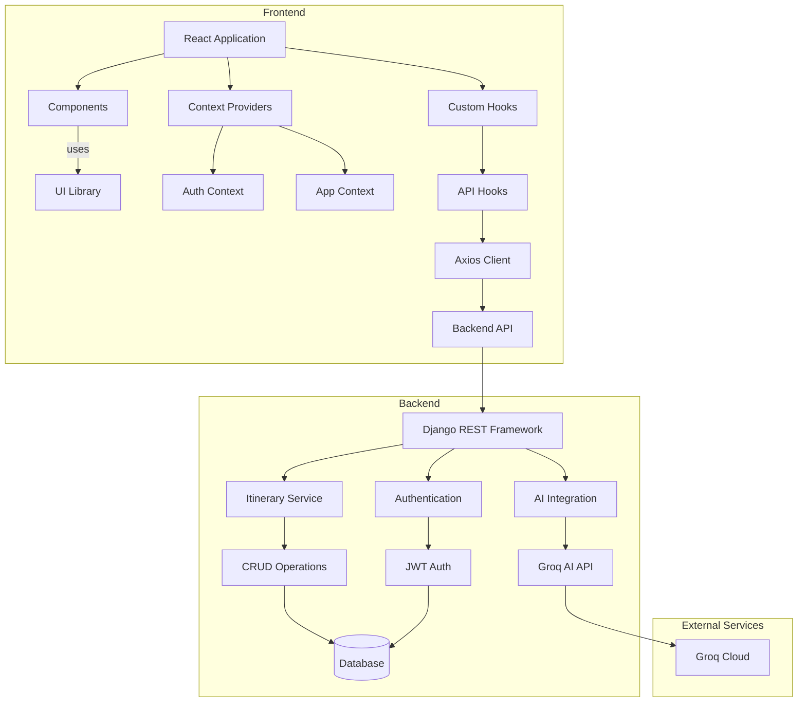
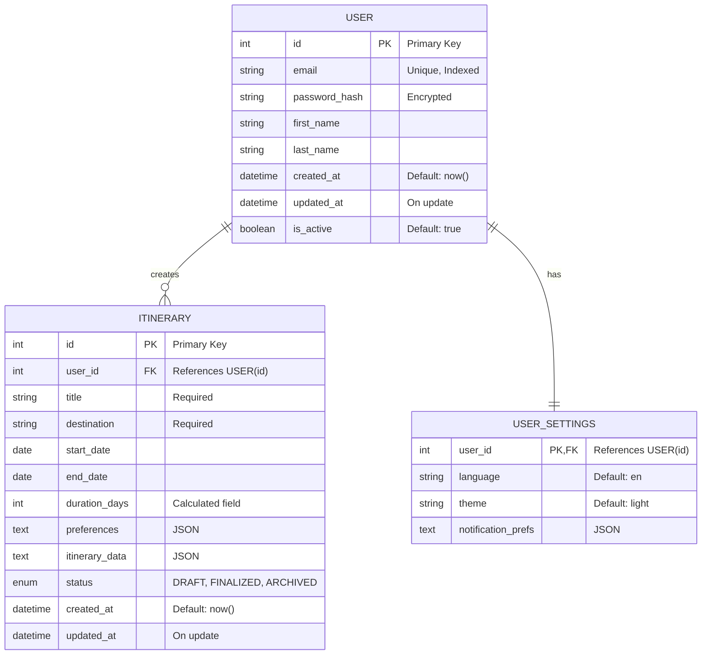
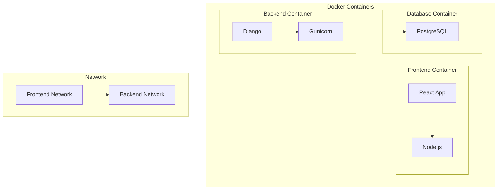

# AI Travel Itinerary Planner

A web application that generates personalized travel itineraries using AI and maintains a history of past requests. The application provides detailed day-by-day plans with activities, timings, and cost estimates.

## Features
- **Smart Itinerary Generation**
  - Input destination and number of days
  - AI-generated daily itineraries with detailed activities
  - Time-based scheduling (AM/PM)
  - Cost estimates for activities
  - Transportation recommendations
  - Local customs and safety tips
  - Docker containerization

- **User Management**
  - User registration and authentication
  - Secure password handling
  - JWT-based session management
  - User-specific itinerary history

- **History & Viewing**
  - Complete history of past requests
  - Detailed view of each itinerary
  - Markdown-formatted descriptions
  - Activity-wise cost breakdown
  - Day-wise organization

- **UI/UX**
  - Responsive design for all devices
  - Dark mode interface
  - Loading states and animations
  - Error handling and notifications
  - Clean and intuitive navigation

## Tech Stack

### Frontend 
- React.js with TypeScript
- TailwindCSS for styling
- Axios for API calls
- React Router for navigation
- React Markdown for rich text rendering
- React Icons for UI elements

### Backend
- Django (Python)
- Django REST Framework
- GROQ AI API for itinerary generation
- JWT Authentication
- CORS support
- SQL LITE

### Infrastructure
- Docker
- Docker Compose
- Nginx (Production)
- Gunicorn

## Architecture



## Database Schema


### Docker Architecture

## Setup Instructions

### Prerequisites
- Python 3.8+
- Node.js 14+
- npm or yarn
- GROQ AI API key

### Backend Setup
1. Create a virtual environment:
```bash
python -m venv venv
source venv/bin/activate  # On Windows: venv\Scripts\activate
```

2. Install dependencies:
```bash
cd backend
pip install -r requirements.txt
```

3. Run migrations:
```bash
python manage.py migrate
```

4. Start the server:
```bash
python manage.py runserver
```

### Frontend Setup
1. Install dependencies:
```bash
cd frontend
npm install
```
2. Add ENV
```
# GROQ API Key
GROQ_API_KEY=xxx

# Firebase Configuration
VITE_FIREBASE_API_KEY=xxx
VITE_FIREBASE_AUTH_DOMAIN=xxx
VITE_FIREBASE_PROJECT_ID=xxx
VITE_FIREBASE_STORAGE_BUCKET=xxx
VITE_FIREBASE_MESSAGING_SENDER_ID=xxx
VITE_FIREBASE_APP_ID=xxx
VITE_FIREBASE_MEASUREMENT_ID=xxx

```

2. Start the development server:
```bash
npm start
```

### Docker Deployment

1. Build and start the containers:
```bash
docker compose up --build
```

2. Access the application:
- Frontend: http://localhost:3000
- Backend API: http://localhost:8000
- Database: localhost:5432

3. Stop the containers:
```bash
docker compose down
```

### Environment Variables

Create a `.env` file in the backend directory with:
```
VITE_FIREBASE_API_KEY=xxx
VITE_FIREBASE_AUTH_DOMAIN=xxx
VITE_FIREBASE_PROJECT_ID=xxx
VITE_FIREBASE_STORAGE_BUCKET=xxx
VITE_FIREBASE_MESSAGING_SENDER_ID=xxx
VITE_FIREBASE_APP_ID=xxx
VITE_FIREBASE_MEASUREMENT_ID=xxx
```
## API Documentation

### Authentication Endpoints
- POST `/api/auth/register/`
  - Request body: `{ "email": string, "password": string }`
  - Returns JWT token

- POST `/api/auth/login/`
  - Request body: `{ "email": string, "password": string }`
  - Returns JWT token

### Itinerary Endpoints
- POST `/api/itinerary/`
  - Request body: `{ "destination": string, "days": number, "user_email": string }`
  - Returns generated itinerary

- GET `/api/history/`
  - Headers: `Authorization: Bearer <token>`
  - Returns list of past itinerary requests

## LLM Integration
This project uses Groq AI to provide ultra-fast inference for Large Language Models (LLMs), delivering sub-second latency for user queries. Groq runs LLMs like Meta's LLaMA 3 and Mistral on its custom-built Language Processing Units (LPUs), optimized specifically for AI workloads.

Groq's API is ideal for high-performance applications where speed is critical — such as generating instant responses in travel itinerary planning. It is accessed using a simple REST API and supports a streaming mode for real-time output.

Models used: Mixtral 8x7B, LLaMA 3

Latency: Typically < 1ms per token

Usage Tier: Free-tier (or as configured)

Docs: https://console.groq.com/keys

## Authentication
Official Firebase Auth Documentation
Firebase Authentication Overview
https://firebase.google.com/products/auth

## Project Structure
```
ai-travel-itinerary-planner/
├── backend/
│   ├── travel_app/
│   │   ├── models.py
│   │   ├── views.py
│   │   ├── serializers.py
│   │   └── urls.py
│   ├── travel_planner/
│   │   ├── settings.py
│   │   └── urls.py
│   ├── manage.py
│   └── requirements.txt
├── frontend/
│   ├── src/
│   │   ├── components/
│   │   ├── contexts/
│   │   ├── types/
│   │   └── App.tsx
│   ├── public/
│   └── package.json
└── README.md
```
