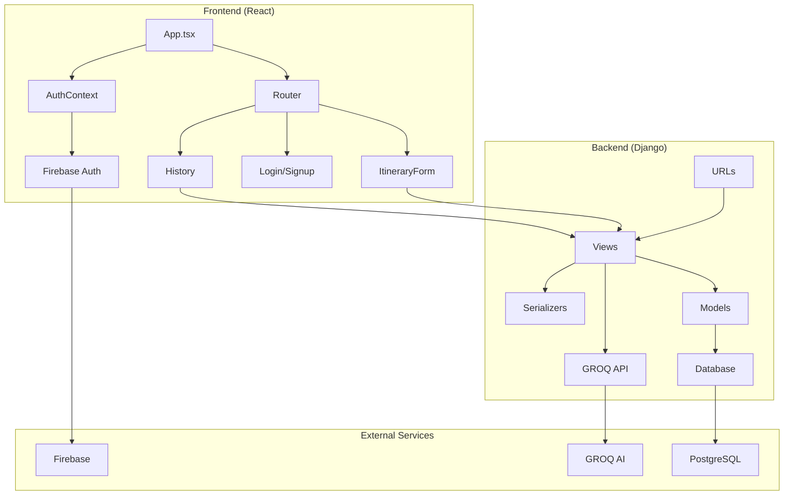
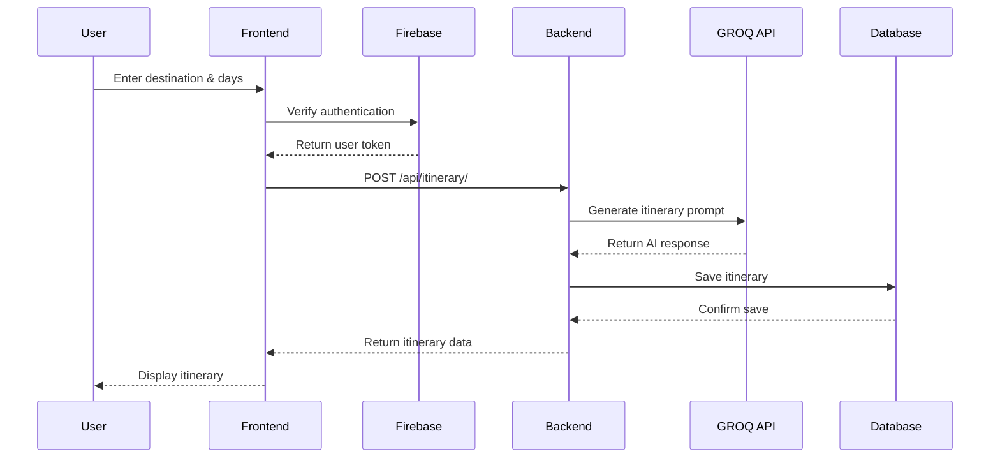
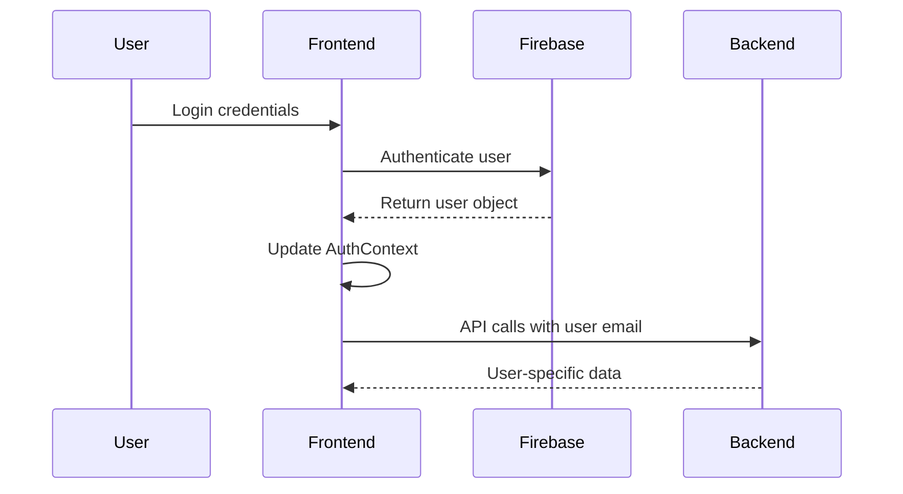
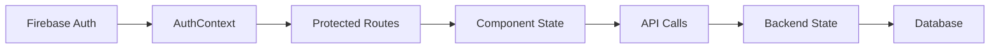
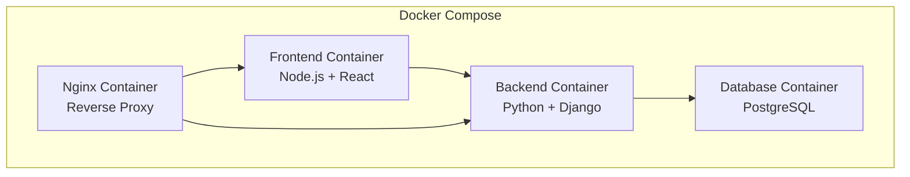

# System Architecture

## Design Patterns Used

### 1. Client-Server Architecture
- **Frontend**: React SPA serving as presentation layer
- **Backend**: Django REST API as business logic layer
- **Database**: PostgreSQL as data persistence layer

### 2. Repository Pattern
- Django ORM abstracts database operations
- Models define data structure and relationships
- Serializers handle data transformation

### 3. Context Pattern (Frontend)
- AuthContext manages global authentication state
- React Context API for state management

### 4. Component-Based Architecture
- Reusable React components
- Separation of concerns between UI and logic

## Component Diagram



## Sequence Diagrams

### Itinerary Generation Flow


### User Authentication Flow


## Database Schema

### Itinerary Model
```sql
CREATE TABLE travel_app_itinerary (
    id SERIAL PRIMARY KEY,
    destination VARCHAR(100) NOT NULL,
    days INTEGER NOT NULL CHECK (days > 0),
    result TEXT NOT NULL,
    created_at TIMESTAMP WITH TIME ZONE DEFAULT NOW(),
    user_email VARCHAR(255)
);

CREATE INDEX idx_itinerary_user_email ON travel_app_itinerary(user_email);
CREATE INDEX idx_itinerary_created_at ON travel_app_itinerary(created_at DESC);
```

## API Endpoints

### Backend REST API

#### POST /api/itinerary/
**Purpose**: Generate new travel itinerary
**Request Body**:
```json
{
  "destination": "string",
  "days": "integer",
  "user_email": "string"
}
```
**Response**:
```json
{
  "id": "integer",
  "destination": "string",
  "days": "integer",
  "result": "string",
  "created_at": "datetime",
  "user_email": "string"
}
```

#### GET /api/history/?user_email={email}
**Purpose**: Retrieve user's itinerary history
**Response**:
```json
[
  {
    "id": "integer",
    "destination": "string",
    "days": "integer",
    "result": "string",
    "created_at": "datetime",
    "user_email": "string"
  }
]
```

## State Management

### Frontend State Architecture

#### Global State (React Context)
- **AuthContext**: User authentication state
  - `currentUser`: Firebase User object
  - `loading`: Authentication loading state
  - Auth methods: `login`, `signup`, `logout`, `signInWithGoogle`

#### Component State
- **ItineraryForm**: Form data, loading states, results
- **History**: Itineraries list, modal state, PDF generation state

#### State Flow


## Security Architecture

### Authentication Flow
1. **Frontend**: Firebase handles user authentication
2. **Backend**: Receives user email for data association
3. **No JWT validation**: Backend trusts frontend authentication

### Data Security
- **API Keys**: GROQ key secured in backend environment
- **CORS**: Configured for specific origins
- **Input Validation**: Django serializers validate input
- **SQL Injection**: Protected by Django ORM

### Security Considerations
- **Missing**: Backend authentication validation
- **Risk**: Frontend can send any email address
- **Recommendation**: Implement Firebase token verification in backend

## Deployment Architecture

### Docker Configuration


### Production Deployment
- **Frontend**: Vercel hosting
- **Backend**: Render.com hosting
- **Database**: PostgreSQL on Render
- **CDN**: Static assets served via CDN

## Performance Considerations

### Bottlenecks
1. **GROQ API**: 2-5 second response time
2. **PDF Generation**: Browser rendering performance
3. **Database**: Simple queries, no optimization needed

### Optimization Opportunities
1. **Caching**: Implement Redis for repeated requests
2. **Pagination**: Add pagination for history view
3. **Lazy Loading**: Implement for large itinerary lists
4. **CDN**: Optimize static asset delivery

### Scalability Limits
- **GROQ API**: Rate limits and token costs
- **Database**: Single instance, no sharding
- **Frontend**: Client-side rendering limitations