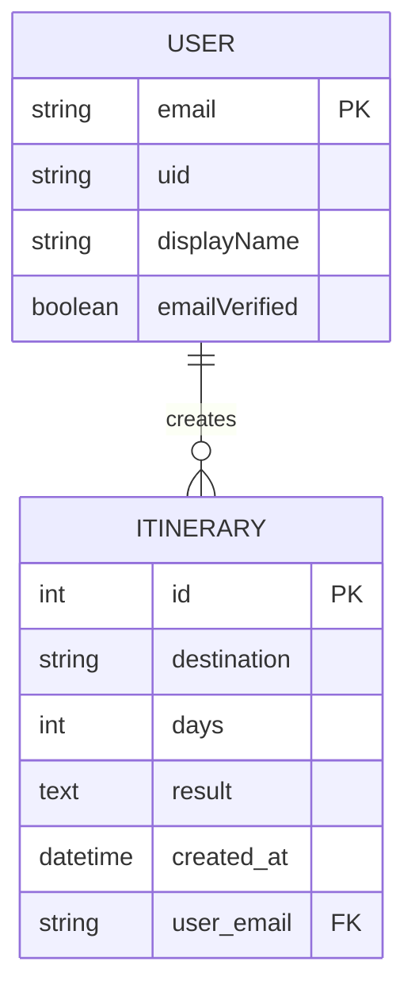
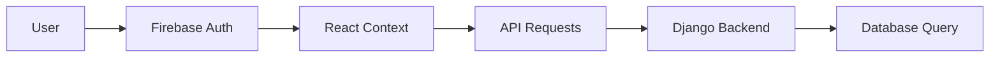

# Data Models

## Database Schemas

### Primary Database: PostgreSQL (Production) / SQLite (Development)

#### Itinerary Table

**Table Name**: `travel_app_itinerary`

**Schema Definition**:
```sql
CREATE TABLE travel_app_itinerary (
    id SERIAL PRIMARY KEY,
    destination VARCHAR(100) NOT NULL,
    days INTEGER NOT NULL CHECK (days > 0),
    result TEXT NOT NULL,
    created_at TIMESTAMP WITH TIME ZONE DEFAULT NOW(),
    user_email VARCHAR(255)
);

-- Indexes for performance
CREATE INDEX idx_itinerary_user_email ON travel_app_itinerary(user_email);
CREATE INDEX idx_itinerary_created_at ON travel_app_itinerary(created_at DESC);
CREATE INDEX idx_itinerary_destination ON travel_app_itinerary(destination);
```

**Field Descriptions**:
- `id`: Auto-incrementing primary key
- `destination`: Travel destination (max 100 characters)
- `days`: Number of travel days (positive integer)
- `result`: Generated itinerary content (unlimited text)
- `created_at`: Timestamp of creation (auto-generated)
- `user_email`: Associated user's email address (nullable)

**Constraints**:
- `days` must be greater than 0
- `destination` cannot be null or empty
- `result` cannot be null

---

## Object/Class Definitions

### Backend Models (Django)

#### Itinerary Model

```python
from django.db import models

class Itinerary(models.Model):
    """
    Model representing a travel itinerary generated by AI.
    
    Attributes:
        destination (str): The travel destination
        days (int): Number of days for the trip
        result (str): The generated itinerary content
        created_at (datetime): When the itinerary was created
        user_email (str): Email of the user who created it
    """
    destination = models.CharField(max_length=100)
    days = models.PositiveIntegerField()
    result = models.TextField()
    created_at = models.DateTimeField(auto_now_add=True)
    user_email = models.EmailField(max_length=255, null=True, blank=True)

    class Meta:
        ordering = ['-created_at']
        verbose_name = 'Travel Itinerary'
        verbose_name_plural = 'Travel Itineraries'

    def __str__(self):
        return f"{self.destination} ({self.days} days) - {self.created_at.strftime('%Y-%m-%d %H:%M')}"

    @property
    def short_result(self):
        """Return truncated version of result for previews."""
        return self.result[:200] + '...' if len(self.result) > 200 else self.result
```

### Frontend Types (TypeScript)

#### Itinerary Interface

```typescript
/**
 * Represents a complete travel itinerary with metadata
 */
export interface Itinerary {
  /** Unique identifier for the itinerary */
  id: number;
  
  /** Travel destination name */
  destination: string;
  
  /** Number of travel days */
  days: number;
  
  /** Generated itinerary content in markdown format */
  result: string;
  
  /** ISO timestamp of creation */
  created_at: string;
  
  /** Email of the user who created the itinerary */
  user_email: string;
}
```

#### ItineraryRequest Interface

```typescript
/**
 * Request payload for creating a new itinerary
 */
export interface ItineraryRequest {
  /** Travel destination name */
  destination: string;
  
  /** Number of travel days (minimum 1) */
  days: number;
  
  /** Email of the requesting user */
  user_email: string;
}
```

#### User Interface (Firebase)

```typescript
/**
 * Firebase User object (simplified)
 */
export interface User {
  /** Unique user identifier */
  uid: string;
  
  /** User's email address */
  email: string | null;
  
  /** Display name */
  displayName: string | null;
  
  /** Profile photo URL */
  photoURL: string | null;
  
  /** Email verification status */
  emailVerified: boolean;
}
```

---

## Type Definitions

### API Response Types

#### Success Response
```typescript
type ApiSuccessResponse<T> = {
  data: T;
  status: 'success';
};
```

#### Error Response
```typescript
type ApiErrorResponse = {
  error: string;
  details?: string;
  status: 'error';
};
```

#### Itinerary API Response
```typescript
type ItineraryResponse = ApiSuccessResponse<Itinerary> | ApiErrorResponse;
```

#### History API Response
```typescript
type HistoryResponse = ApiSuccessResponse<Itinerary[]> | ApiErrorResponse;
```

### Component Props Types

#### Authentication Context Type
```typescript
interface AuthContextType {
  /** Current authenticated user */
  currentUser: User | null;
  
  /** Login function */
  login: (email: string, password: string) => Promise<UserCredential>;
  
  /** Signup function */
  signup: (email: string, password: string) => Promise<UserCredential>;
  
  /** Logout function */
  logout: () => Promise<void>;
  
  /** Google sign-in function */
  signInWithGoogle: () => Promise<UserCredential>;
  
  /** Loading state */
  loading: boolean;
}
```

#### Component State Types
```typescript
// Itinerary Form State
interface ItineraryFormState {
  formData: ItineraryRequest;
  loading: boolean;
  result: string | null;
  error: string | null;
  pdfLoading: boolean;
}

// History Component State
interface HistoryState {
  itineraries: Itinerary[];
  loading: boolean;
  error: string | null;
  pdfLoading: number | null;
  expandedItinerary: number | null;
  modalItinerary: Itinerary | null;
}
```

---

## Validation Rules

### Backend Validation (Django Serializers)

#### ItineraryCreateSerializer
```python
from rest_framework import serializers

class ItineraryCreateSerializer(serializers.Serializer):
    destination = serializers.CharField(
        max_length=100,
        required=True,
        error_messages={
            'required': 'Destination is required.',
            'max_length': 'Destination must be 100 characters or less.',
            'blank': 'Destination cannot be empty.'
        }
    )
    
    days = serializers.IntegerField(
        min_value=1,
        max_value=365,
        required=True,
        error_messages={
            'required': 'Number of days is required.',
            'min_value': 'Trip must be at least 1 day.',
            'max_value': 'Trip cannot exceed 365 days.',
            'invalid': 'Days must be a valid number.'
        }
    )
    
    user_email = serializers.EmailField(
        required=True,
        error_messages={
            'required': 'User email is required.',
            'invalid': 'Enter a valid email address.'
        }
    )
    
    def validate_destination(self, value):
        """Custom validation for destination field."""
        if not value.strip():
            raise serializers.ValidationError("Destination cannot be empty.")
        return value.strip().title()
```

### Frontend Validation (TypeScript)

#### Form Validation Functions
```typescript
/**
 * Validates itinerary form data
 */
export const validateItineraryForm = (data: ItineraryRequest): string[] => {
  const errors: string[] = [];
  
  // Destination validation
  if (!data.destination.trim()) {
    errors.push('Destination is required.');
  } else if (data.destination.length > 100) {
    errors.push('Destination must be 100 characters or less.');
  }
  
  // Days validation
  if (!data.days || data.days < 1) {
    errors.push('Trip must be at least 1 day.');
  } else if (data.days > 365) {
    errors.push('Trip cannot exceed 365 days.');
  }
  
  // Email validation
  const emailRegex = /^[^\s@]+@[^\s@]+\.[^\s@]+$/;
  if (!data.user_email || !emailRegex.test(data.user_email)) {
    errors.push('Valid email address is required.');
  }
  
  return errors;
};

/**
 * Validates authentication form data
 */
export const validateAuthForm = (email: string, password: string): string[] => {
  const errors: string[] = [];
  
  // Email validation
  const emailRegex = /^[^\s@]+@[^\s@]+\.[^\s@]+$/;
  if (!email || !emailRegex.test(email)) {
    errors.push('Valid email address is required.');
  }
  
  // Password validation
  if (!password) {
    errors.push('Password is required.');
  } else if (password.length < 6) {
    errors.push('Password must be at least 6 characters.');
  }
  
  return errors;
};
```

---

## Relationships

### Data Relationships

#### User-Itinerary Relationship
- **Type**: One-to-Many (soft relationship)
- **Implementation**: Email-based association
- **Constraint**: No foreign key constraint (Firebase users not in Django)



### Data Flow Relationships

#### Frontend to Backend


#### Authentication Flow


---

## Data Constraints and Business Rules

### Business Rules

1. **Itinerary Creation**:
   - User must be authenticated
   - Destination cannot be empty
   - Days must be positive integer
   - Maximum 365 days per trip

2. **Data Access**:
   - Users can only access their own itineraries
   - Itineraries are filtered by user email
   - No cross-user data access

3. **Data Retention**:
   - No automatic deletion of itineraries
   - All itineraries are preserved indefinitely
   - Users cannot delete individual itineraries (feature not implemented)

### Database Constraints

```sql
-- Ensure days is positive
ALTER TABLE travel_app_itinerary 
ADD CONSTRAINT check_positive_days 
CHECK (days > 0);

-- Ensure destination is not empty
ALTER TABLE travel_app_itinerary 
ADD CONSTRAINT check_destination_not_empty 
CHECK (LENGTH(TRIM(destination)) > 0);

-- Ensure result is not empty
ALTER TABLE travel_app_itinerary 
ADD CONSTRAINT check_result_not_empty 
CHECK (LENGTH(TRIM(result)) > 0);
```

### Performance Considerations

1. **Indexing Strategy**:
   - Primary index on `id` (automatic)
   - Index on `user_email` for user queries
   - Index on `created_at` for chronological sorting
   - Composite index on `(user_email, created_at)` for optimal history queries

2. **Query Optimization**:
   - Use `select_related()` for related data (not applicable here)
   - Implement pagination for large result sets
   - Consider caching for frequently accessed data

3. **Storage Optimization**:
   - `result` field can be large (AI-generated content)
   - Consider compression for long itineraries
   - Monitor database size growth