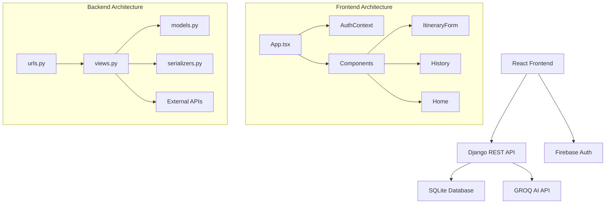

# Architectural Analysis

## Design Pattern Compliance

✅ **MVC Pattern**: Properly separated between Django backend (Model-View) and React frontend (View-Controller)
⚠️ **Service Layer Missing**: Business logic mixed with API views instead of separate service classes
❌ **Repository Pattern**: Direct ORM usage in views instead of repository abstraction
✅ **Component Pattern**: React components properly structured
⚠️ **Context Pattern**: AuthContext implemented but could be optimized

## SOLID Principles Analysis

| Principle | Status | Issues | Recommendations |
|-----------|--------|--------|------------------|
| **Single Responsibility** | ⚠️ | `ItineraryView` handles validation, API calls, and database operations | Extract service layer |
| **Open/Closed** | ❌ | Hard to extend without modifying existing code | Use dependency injection |
| **Liskov Substitution** | ✅ | No inheritance issues detected | Continue current approach |
| **Interface Segregation** | ⚠️ | Large API responses, no interface contracts | Define specific DTOs |
| **Dependency Inversion** | ❌ | Direct dependencies on concrete classes | Implement abstractions |

## Current Architecture Overview



## Architectural Issues

### 1. Weak Data Model
```python
# Current: Poor data integrity
class Itinerary(models.Model):
    user_email = models.EmailField()  # No foreign key relationship
    destination = models.CharField(max_length=255)
    days = models.IntegerField()
    result = models.TextField()
    created_at = models.DateTimeField(auto_now_add=True)

# Recommended: Proper user relationship
class User(models.Model):
    firebase_uid = models.CharField(max_length=128, unique=True)
    email = models.EmailField(unique=True)
    created_at = models.DateTimeField(auto_now_add=True)

class Itinerary(models.Model):
    user = models.ForeignKey(User, on_delete=models.CASCADE)
    destination = models.CharField(max_length=255)
    days = models.PositiveIntegerField(validators=[MinValueValidator(1), MaxValueValidator(30)])
    result = models.TextField()
    created_at = models.DateTimeField(auto_now_add=True)
    
    class Meta:
        ordering = ['-created_at']
        indexes = [
            models.Index(fields=['user', '-created_at']),
        ]
```

### 2. Missing Service Layer
```python
# Current: Business logic in views
class ItineraryView(APIView):
    def post(self, request):
        # Validation logic
        # API call logic
        # Database save logic
        # All mixed together

# Recommended: Separate service layer
class ItineraryService:
    def __init__(self, ai_client, cache_service):
        self.ai_client = ai_client
        self.cache_service = cache_service
    
    def generate_itinerary(self, user, destination, days):
        # Business logic here
        pass
    
    def get_user_itineraries(self, user, page=1, per_page=10):
        # Pagination logic here
        pass

class ItineraryView(APIView):
    def __init__(self):
        self.service = ItineraryService(groq_client, cache_service)
    
    def post(self, request):
        # Only handle HTTP concerns
        pass
```

### 3. Tight Coupling Issues

**Frontend-Backend Coupling**
```javascript
// Current: Hardcoded API URLs
const API_URL = 'https://ai-travel-itinerary-planner.onrender.com/api/itinerary/';

// Recommended: Configuration-based
const API_BASE_URL = process.env.REACT_APP_API_URL || 'http://localhost:8000';
const endpoints = {
  itinerary: `${API_BASE_URL}/api/itinerary/`,
  history: `${API_BASE_URL}/api/history/`,
};
```

**Component Coupling**
```javascript
// Current: Direct API calls in components
const History = () => {
  const fetchItineraries = async () => {
    const response = await fetch(...);
    // Direct fetch logic
  };
};

// Recommended: Service abstraction
class ApiService {
  async getItineraries(userEmail, page = 1) {
    // Centralized API logic
  }
  
  async generateItinerary(destination, days) {
    // Centralized API logic
  }
}

const useApiService = () => {
  return useMemo(() => new ApiService(), []);
};
```

## Scalability Concerns

### 1. Database Scalability
```python
# Issues:
# - SQLite not suitable for production
# - No connection pooling
# - No read replicas
# - No database migrations strategy

# Recommendations:
DATABASES = {
    'default': {
        'ENGINE': 'django.db.backends.postgresql',
        'NAME': os.getenv('DB_NAME'),
        'USER': os.getenv('DB_USER'),
        'PASSWORD': os.getenv('DB_PASSWORD'),
        'HOST': os.getenv('DB_HOST'),
        'PORT': os.getenv('DB_PORT'),
        'OPTIONS': {
            'MAX_CONNS': 20,
            'CONN_MAX_AGE': 600,
        }
    }
}
```

### 2. API Scalability
```python
# Current: No rate limiting or caching
class ItineraryView(APIView):
    def post(self, request):
        # Expensive AI API call every time
        pass

# Recommended: Add middleware
from django_ratelimit.decorators import ratelimit
from django.core.cache import cache

class ItineraryView(APIView):
    @ratelimit(key='user', rate='10/h', method='POST')
    def post(self, request):
        # Check cache first
        cache_key = self.get_cache_key(destination, days)
        cached_result = cache.get(cache_key)
        if cached_result:
            return Response(cached_result)
        
        # Generate and cache result
        result = self.generate_itinerary(destination, days)
        cache.set(cache_key, result, timeout=3600)
        return Response(result)
```

### 3. Frontend Scalability
```javascript
// Current: No state management for complex data
// Recommended: Add Redux or Zustand for global state

// store/itineraryStore.js
import { create } from 'zustand';

const useItineraryStore = create((set, get) => ({
  itineraries: [],
  loading: false,
  error: null,
  
  fetchItineraries: async (userEmail) => {
    set({ loading: true, error: null });
    try {
      const data = await apiService.getItineraries(userEmail);
      set({ itineraries: data, loading: false });
    } catch (error) {
      set({ error: error.message, loading: false });
    }
  },
  
  addItinerary: (itinerary) => {
    set((state) => ({
      itineraries: [itinerary, ...state.itineraries]
    }));
  }
}));
```

## Security Architecture Issues

### 1. Authentication Architecture
```python
# Current: No backend token validation
class ItineraryView(APIView):
    def post(self, request):
        user_email = request.data.get('user_email')  # Trusts frontend

# Recommended: Proper authentication middleware
from firebase_admin import auth

class FirebaseAuthenticationMiddleware:
    def __init__(self, get_response):
        self.get_response = get_response
    
    def __call__(self, request):
        if request.path.startswith('/api/'):
            token = request.headers.get('Authorization', '').replace('Bearer ', '')
            try:
                decoded_token = auth.verify_id_token(token)
                request.user_email = decoded_token['email']
                request.user_uid = decoded_token['uid']
            except Exception:
                return JsonResponse({'error': 'Invalid token'}, status=401)
        
        return self.get_response(request)
```

### 2. Data Validation Architecture
```python
# Current: Minimal validation
class ItinerarySerializer(serializers.ModelSerializer):
    class Meta:
        model = Itinerary
        fields = '__all__'

# Recommended: Comprehensive validation
class ItinerarySerializer(serializers.ModelSerializer):
    destination = serializers.CharField(
        max_length=100,
        validators=[RegexValidator(r'^[a-zA-Z\s,.-]+$', 'Invalid destination format')]
    )
    days = serializers.IntegerField(
        min_value=1,
        max_value=30,
        error_messages={'min_value': 'Minimum 1 day', 'max_value': 'Maximum 30 days'}
    )
    
    class Meta:
        model = Itinerary
        fields = ['destination', 'days']
    
    def validate_destination(self, value):
        # Additional business logic validation
        if len(value.strip()) < 2:
            raise serializers.ValidationError('Destination too short')
        return value.strip().title()
```

## Recommended Architecture Improvements

### 1. Layered Architecture
```
┌─────────────────────────────────────┐
│           Presentation Layer        │
│  (React Components, API Views)      │
├─────────────────────────────────────┤
│           Service Layer             │
│  (Business Logic, Validation)       │
├─────────────────────────────────────┤
│           Repository Layer          │
│  (Data Access, ORM Abstraction)     │
├─────────────────────────────────────┤
│           Infrastructure Layer      │
│  (Database, External APIs, Cache)   │
└─────────────────────────────────────┘
```

### 2. Microservices Consideration
```yaml
# For future scaling, consider splitting into:
services:
  auth-service:
    responsibility: "User authentication and authorization"
    technology: "Django + Firebase Admin SDK"
  
  itinerary-service:
    responsibility: "Itinerary generation and management"
    technology: "Django + GROQ API"
  
  notification-service:
    responsibility: "Email notifications, alerts"
    technology: "Django + Celery"
  
  frontend-service:
    responsibility: "User interface"
    technology: "React + TypeScript"
```

### 3. Event-Driven Architecture
```python
# Implement event system for loose coupling
from django.dispatch import Signal

itinerary_generated = Signal()
itinerary_exported = Signal()
user_registered = Signal()

class ItineraryService:
    def generate_itinerary(self, user, destination, days):
        itinerary = self.create_itinerary(user, destination, days)
        
        # Emit event for other services
        itinerary_generated.send(
            sender=self.__class__,
            itinerary=itinerary,
            user=user
        )
        
        return itinerary

# Event handlers
@receiver(itinerary_generated)
def send_notification(sender, itinerary, user, **kwargs):
    # Send email notification
    pass

@receiver(itinerary_generated)
def update_analytics(sender, itinerary, user, **kwargs):
    # Update usage analytics
    pass
```

## Performance Architecture

### 1. Caching Strategy
```python
# Multi-level caching
CACHES = {
    'default': {
        'BACKEND': 'django_redis.cache.RedisCache',
        'LOCATION': 'redis://127.0.0.1:6379/1',
    },
    'sessions': {
        'BACKEND': 'django_redis.cache.RedisCache',
        'LOCATION': 'redis://127.0.0.1:6379/2',
    }
}

# Cache levels:
# 1. Browser cache (static assets)
# 2. CDN cache (API responses)
# 3. Application cache (expensive computations)
# 4. Database query cache
```

### 2. Database Optimization
```python
# Optimized models with proper indexing
class Itinerary(models.Model):
    user = models.ForeignKey(User, on_delete=models.CASCADE)
    destination = models.CharField(max_length=100, db_index=True)
    days = models.PositiveSmallIntegerField()
    result = models.TextField()
    created_at = models.DateTimeField(auto_now_add=True, db_index=True)
    
    class Meta:
        ordering = ['-created_at']
        indexes = [
            models.Index(fields=['user', '-created_at']),
            models.Index(fields=['destination', 'days']),  # For caching
        ]
```

## Migration Strategy

### Phase 1: Foundation (Week 1-2)
1. Implement proper User model
2. Add Firebase token validation
3. Create service layer structure
4. Add comprehensive logging

### Phase 2: Architecture (Week 3-4)
1. Implement repository pattern
2. Add caching layer
3. Create API service abstraction
4. Add error boundaries

### Phase 3: Optimization (Week 5-6)
1. Database optimization
2. Frontend performance improvements
3. Add monitoring and metrics
4. Implement rate limiting

### Phase 4: Scalability (Week 7-8)
1. Consider microservices split
2. Implement event-driven patterns
3. Add comprehensive testing
4. Production deployment optimization

## Architecture Quality Score

**Overall Score: 58/100**

- **Separation of Concerns**: 60/100
- **Scalability**: 45/100
- **Maintainability**: 55/100
- **Security**: 50/100
- **Performance**: 40/100
- **Testability**: 30/100